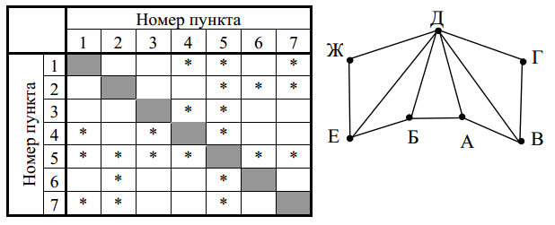

# Результаты
Проснулся поздно, поэтому не весь вариант решал. Сейчас (19.05.21 11:27) пойду в лицей
| Номер задания | Мой ответ | Правильный ответ | Статус |
|:--|:--|:--|:--|
| 1 | 17 |  |  |
| 2 | wzxy |  |  |
| 3 |  |  |  |
| 4 |  |  |  |
| 5 |  |  |  |
| 6 |  |  |  |
| 7 | 24 |  |  |
| 8 | 45000 | 458752 | X |
| 9 |  |  |  |
| 10 |  |  |  |
| 11 | 22016 |  |  |
| 12 | 120 |  |  |
| 13 |  |  |  |
| 14 |  |  |  |
| 15 | 2 | 36 | X |
| 16 |  |  |  |
| 17 |  |  |  |
| 18 |  |  |  |
| 19 | 27 |  |  |
| 20 | 24 26 |  |  |
| 21 | 23 |  |  |
| 22 |  |  |  |
| 23 |  |  |  |
| 24 |  |  |  |
| 25 |  |  |  |
| 26 |  |  |  |
| 27 |  |  |  |

# Задания
Задание 1 (№1184).
На рисунке справа изображена схема дорог N-ского района, в таблице звёздочкой обозначено наличие дороги из одного населённого пункта в другой. Отсутствие звёздочки означает, что такой дороги нет. Определите, какие номера населённых пунктов в таблице могут соответствовать населённым пунктам А и Б на схеме.  
В ответ запишите эти два номера в возрастающем порядке без пробелов и знаков препинания

Задание 12 (№1195).
Исполнитель Редактор получает на вход строку цифр и преобразовывает её.
Определите максимально возможное количество цифр 3, которое может получиться в результате применения представленного ниже алгоритма к строке, состоящей из 30 цифр 3, 30 цифр 4 и 30 цифр 5, идущих в произвольном порядке.

