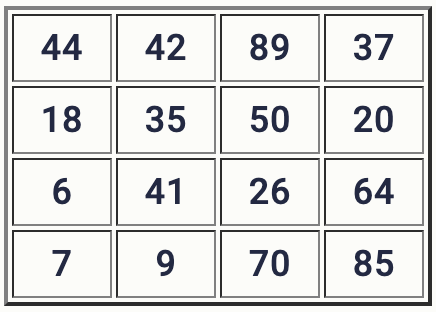

# Результаты
Первичный балл: _16_/30  

| Номер задания | Мой ответ | Правильный ответ | Статус |
|:--|:--|:--|:--|
| 1 | - | 29 | X |
| 2 | zyxw |  |  |
| 3 | 426 | 20 | X |
| 4 | 14 |  |  |
| 5 | 5 |  |  |
| 6 | 1 |  |  |
| 7 | 4 | 16 | X |
| 8 | 810 | 6075 | X |
| 9 | 51 |  |  |
| 10 | 2 |  |  |
| 11 | 41 | 43 | X |
| 12 | 34 |  |  |
| 13 | 72 |  |  |
| 14 | 7 |  |  |
| 15 | 2 | 20 | X |
| 16 | 120 |  |  |
| 17 | 10777 345681 |  |  |
| 18 | 1253 | 1296 | X |
| 19 | 9 |  |  |
| 20 | - | 8 20 23 | X |
| 21 | - | 24 | X |
| 22 | 9 |  |  |
| 23 | 512 |  |  |
| 24 | - | 1001 | X |
| 25 | 408146688 452984832 516560652 573308928 |  |  |
| 26 | - | 15 954387771 | X |
| 27 | - | 44067 301653067 | X |

# Наблюдения
* **1** Что? Кого? Куда? А что так мало вводных...
* **20** Вообще хз, что здесь не так. Вроде всё верно...  
* **22** Надо переделать, там я делал наугад и получил 9. Ну как, наугад, я просто вручную перебирал.
Сложность состоит в том, что алгоритм тупо виснет. А если вручную набрать, например, число 5, то приведённый алгоритм также виснет  
* **23** Надо повторить/выучить алгоритм  
* **24** Надо сделать  
* **25** Надо оптимизировать через логарифм, но там есть нюанс...  
* **26** Надо сделать  
* **27** Хотя бы посмотреть его, кажется, простенькое  

# Комментарии
- В 3 надо было прочитать условие. Дядю нашёл, но суть в том, что надо было 2007 - 1987 _(426 id)_ = **20**.
- Не 2 в 4 степени => 4, а 16 - ответ.
- 24 задание решил уже после пробника

# Условия заданий
### № 1
Так как таблицу и схему рисовали независимо друг от друга, нумерация населённых пунктов в таблице никак не связана с буквенными обозначениями на графе. Известно, что длина дороги ГЕ больше, чем длина дороги ГЖ.

### № 2
Даны фрагменты двух таблиц из базы данных. Каждая строка таблицы 2 содержит информацию о ребёнке и об одном из его родителей. Информация представлена значением поля ID в соответствующей строке таблицы 1.
На основании имеющихся данных определите самого молодого человека среди тех, у кого есть племянники или племянницы. В ответе запишите количество полных лет, исполнившихся этому человеку в момент рождения первого племянника или племянницы.

### № 7
В информационной системе хранятся изображения размером 2048 × 1536 пк. При кодировании используется алгоритм сжатия изображений, позволяющий уменьшить размер памяти для хранения одного изображения в среднем в 4 раза по сравнению с независимым кодированием каждого пикселя. Каждое изображение дополняется служебной информацией, которая занимает 128 Кбайт. Для хранения 32 изображений потребовалось 16 Мбайт. Сколько цветов использовано в палитре каждого изображения?

### № 8
Настя составляет 6-буквенные коды из букв Н, А, С, Т, Я. Каждая допустимая гласная буква может входить в код не более одного раза. Сколько кодов может составить Настя?

### № 11
Каждый объект, зарегистрированный в информационной системе, получает уникальный код из 9 символов, каждый из которых может быть одной из 26 заглавных или строчных латинских букв. Для представления кода используют посимвольное кодирование, все символы кодируют одинаковым минимально возможным количеством битов, а для кода в целом выделяется минимально возможное целое количество байтов. Кроме того, для каждого объекта в системе выделен одинаковый объём памяти для хранения содержательной информации. Для хранения данных (код и содержательная информация) о 50 объектах потребовалось 2500 байт. Сколько байтов выделено для хранения содержательной информации об одном объекте?
В ответе запишите только целое число – количество байтов.

### № 15
Обозначим через 𝑚 & 𝑛 поразрядную конъюнкцию неотрицательных целых чисел 𝑚 и 𝑛.
Например, 14 & 5 = 11102 & 01012 = 01002 = 4.
Для какого наименьшего неотрицательного целого числа А формула
𝑥 & 73 = 0 → (𝑥 & 28 ≠ 0 → 𝑥 & А ≠ 0)
тождественно истинна (т. е. принимает значение 1 при любом неотрицательном целом значении переменной 𝑥)?

### № 18
Дан квадрат 15×15 клеток, в каждой клетке которого записано целое число. В левом верхнем углу квадрата стоит робот. За один ход робот может переместиться на одну клетку вправо или на одну клетку вниз. Выходить за пределы квадрата робот не может. При этом ведётся подсчёт суммы по следующим правилам: число в очередной клетке, через которую проходит робот, включается в сумму, если оно больше числа в предыдущей клетке на пути робота. Если число в очередной клетке не больше числа в предыдущей, сумма не изменяется. Число в начальной клетке всегда включается в сумму. Необходимо переместить робота в правый нижний угол так, чтобы полученная сумма была максимальной.
В ответе запишите максимально возможную сумму.
Исходные данные записаны в электронной таблице.
Пример входных данных (для таблицы размером 4×4):

Для указанных входных данных оптимальным маршрутом будет путь по клеткам 44, 42, 89, 50, 26, 70, 85.
Итоговая сумма равна 44 + 89 + 70 + 85 = 288. Числа 42, 50 и 26 не включаются в сумму, так как 42 < 44, 50 < 89 и 26 < 50.

### № 19
Два игрока, Петя и Ваня, играют в следующую игру. Перед игроками лежат две кучи камней. Игроки ходят по очереди, первый ход делает Петя. За один ход игрок может добавить в одну из куч один камень или увеличить количество камней в куче в три раза. Например, пусть в одной куче 5 камней, а в другой 9 камней; такую позицию мы будем обозначать (5, 9). За один ход из позиции (5, 9) можно получить любую из четырёх позиций: (6, 9), (15, 9), (5, 10), (5, 27). Чтобы делать ходы, у каждого игрока есть неограниченное количество камней.  
Игра завершается в тот момент, когда суммарное количество камней в кучах становится не менее 79. Победителем считается игрок, сделавший последний ход, то есть первым получивший позицию, в которой в кучах будет 79 или больше камней.  
В начальный момент в первой куче было 6 камней, во второй куче – 𝑆 камней, 1≤𝑆≤72.  
Будем говорить, что игрок имеет выигрышную стратегию, если он может выиграть при любых ходах противника.  
Известно, что Ваня выиграл своим первым ходом после неудачного первого хода Пети. Назовите минимальное значение 𝑆, при котором это возможно.  

### № 20
Найдите все такие значения 𝑆, при которых у Пети есть выигрышная стратегия, причём Петя не может выиграть первым ходом, но может выиграть своим вторым ходом независимо от того, как будет ходить Ваня.      
Найденные значения запишите в ответе в порядке возрастания (в отдельные поля для ответов).  

### № 21
Укажите максимальное значение 𝑆, при котором у Вани есть выигрышная стратегия, позволяющая ему выиграть при любой игре Пети.  

### № 27

В текстовом файле записан набор пар натуральных чисел, не превышающих 10 000. Необходимо выбрать из набора некоторые пары так, чтобы первое число в каждой выбранной паре было нечётным, сумма бо́льших чисел во всех выбранных парах была нечётной, а сумма меньших – чётной. Какую наибольшую сумму чисел во всех выбранных парах можно при этом получить?

**Входные данные**
Первая строка входного файла содержит целое число 𝑁 – общее количество чисел в наборе. Каждая из следующих 𝑁 строк содержит одно число.

**Пример входного файла**  
4  
5 2  
8 15  
7 14  
11 9  
В данном случае есть три подходящие пары: (5, 2), (7, 14) и (11, 9). Пара (8, 15) не подходит, так как в ней первое число чётное. Чтобы удовлетворить требования, надо взять пары (7, 14) и (11, 9). Сумма бо́льших чисел в этом случае равна 25, сумма меньших равна 16. Общая сумма равна 41. В ответе надо указать число 41.

Вам даны два входных файла (A и B), каждый из которых имеет описанную выше структуру. В ответе укажите два числа: сначала значение искомой суммы для файла A, затем для файла B.
